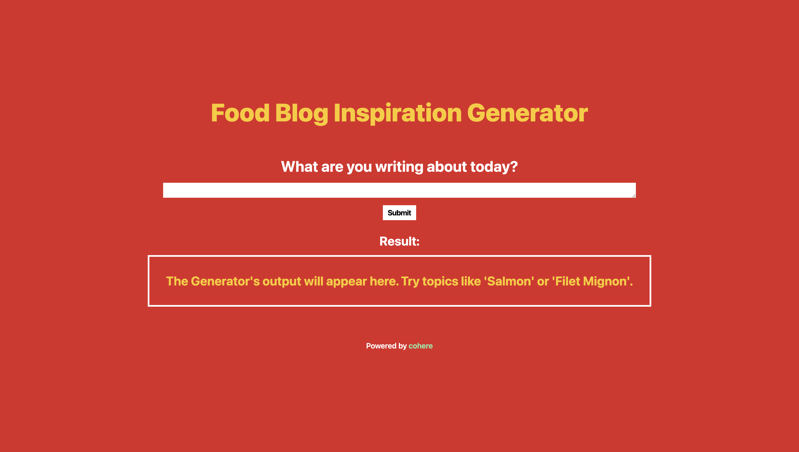
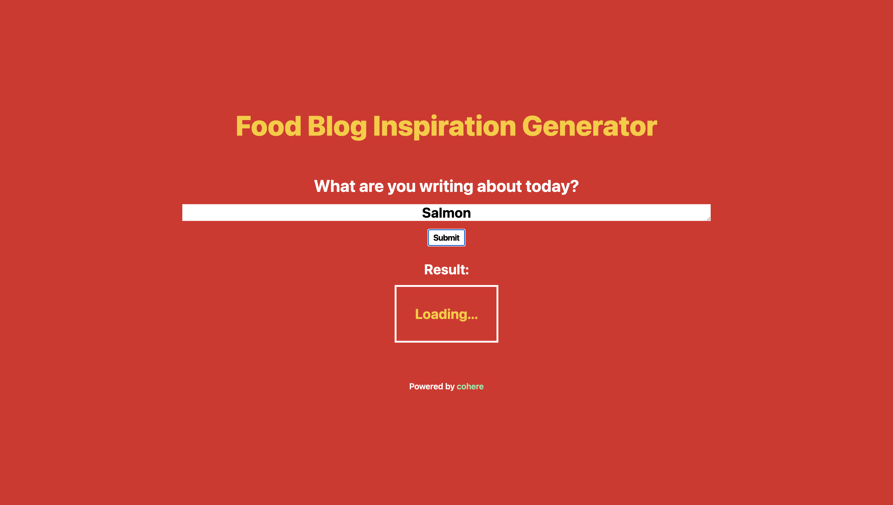
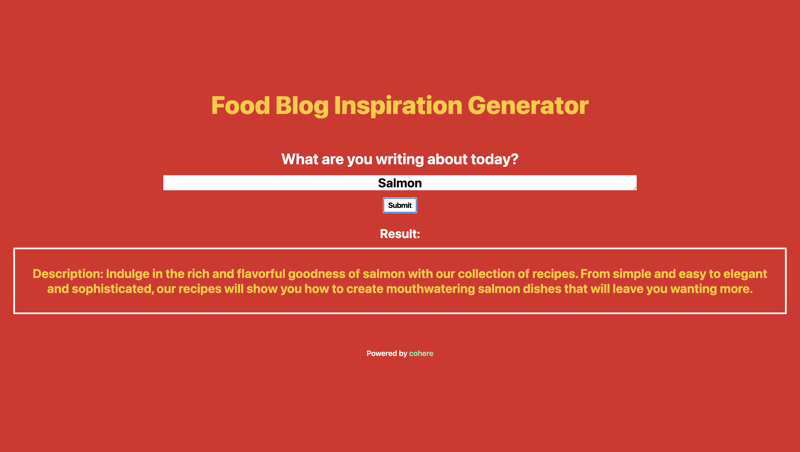
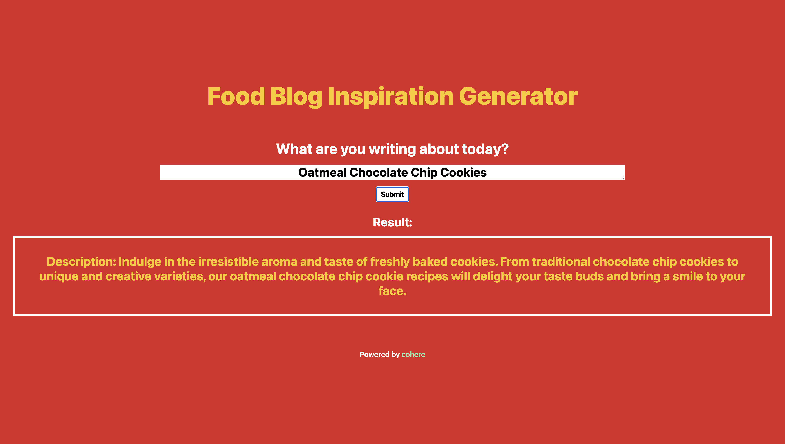

# Cohere Food Blog Inspiration Generator 

## Description

Writing a blog? Don't know where to start, or need some inspiration to get rolling? This Food Blog Inspiration Generator powered by Cohere has you covered! Just type in your topic, click the submit button, and you're set!

Learn about Cohere https://docs.cohere.com/docs. 

## Installation

1. Clone this repository. 
2. Open your terminal and create 2 instances/tabs. Navigate to the root directory in the first tab, then "cd" into the 'client' folder in the second tab. 
3. Run "npm i" on both tabs (root directory and client folder).
4. Then run npm start on both tabs.

Note: You will need a Cohere API Key. Sign up at https://dashboard.cohere.ai/register.

## Usage

### Screenshots

#### Step 1. Landing Page ####

#### Step 2. Type in your topic and click the Submit button ####

#### Step 3. Ta-da! Output for Salmon.  ####

#### Step 4. Output for Cookies. ####

